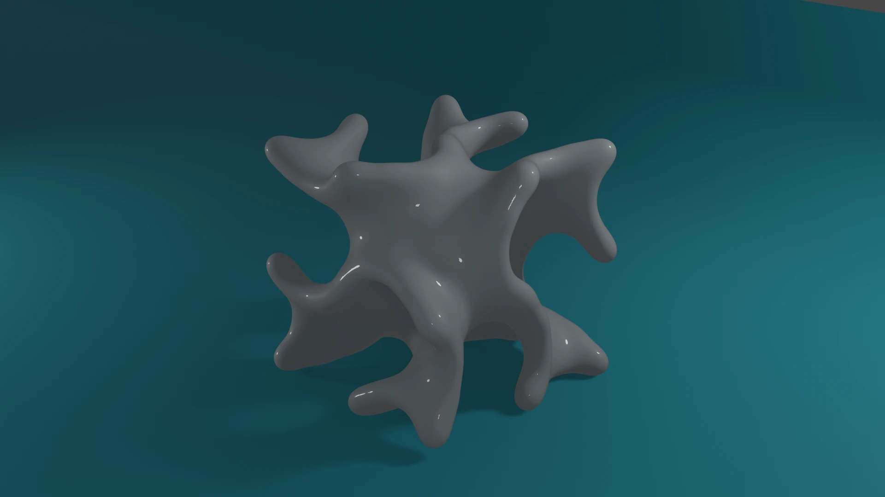

# GYROID



A gyroid is a tripperly period minimal surface.

It has a approximate definition :-

f  = sin(x) * cos(y) + sin(y) * cos(z) + sin(z) * cos(x) = 0

where

-π < x < π, -π < y < π, -π < z < π

[Wikipedia reference](https://en.wikipedia.org/wiki/Gyroid)

This rust binary generates a point cloud [ points on the surface.]

```bash
time cargo r --release  > pc.json
```

## Marching Cubes

The included shell script uses sensible parameters to configure [splashsurf](https://crates.io/crates/splashsurf/0.9.1). The output is a obj file which can be imported in a program like [blender](https://www.blender.org/).

```bash
./go.sh
```


